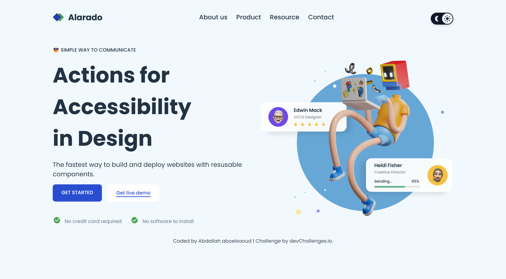

<!-- Please update value in the {}  -->

<h1 align="center">{Simple Homepage} | devChallenges</h1>

   Solution for a challenge <a href="https://devchallenges.io/challenge/simple-hompage-alarado" target="_blank">Simple Homepage - Alarado </a> from <a href="http://devchallenges.io" target="_blank">devChallenges.io</a>.

  <h3>
    <a href="{https://whompage.netlify.app/}">
      Demo
    </a>
     | 
    <a href="{https://github.com/Saoud2021/simple-homepage-master}">
      Solution
    </a>
     | 
    <a href="https://devchallenges.io/challenge/simple-hompage-alarado">
      Challenge
    </a>
  </h3>

<!-- TABLE OF CONTENTS -->

## Table of Contents

- [Overview](#overview)
  - [What I learned](#what-i-learned)
  - [Useful resources](#useful-resources)
- [Built with](#built-with)
- [Features](#features)
- [Contact](#contact)
- [Acknowledgements](#acknowledgements)

<!-- OVERVIEW -->

## Overview

This project is a responsive landing page built as part of the Alarado Homepage Challenge from DevChallenges. The goal was to recreate a pixel-perfect homepage with an intuitive dark mode toggle and fully responsive navigation.

🔧 What I improved:
I strengthened my layout structuring skills with semantic HTML and CSS custom properties. I also practiced modular JavaScript to manage dynamic interactions like the theme toggle and responsive hamburger menu.

💡 My takeaway:
Small UX features like dark mode, mobile navigation overlays, and hover animations dramatically enhance usability. Simplicity + functionality is the real power.

### What I learned

- 🧠 How to implement dark/light theme toggling using data-theme and CSS variables.

- 💪 Improved mobile-first responsive design, especially with Flexbox layouts and media queries.

- 🔄 Implemented mobile menu toggle logic that closes on link click and window resize using concise and reusable code: 
 > const closeMobileMenu = () => {
 > hamburger.classList.remove("active");
 > mobileNav.classList.remove("active");
 >  mobileNavOverlay.classList.remove("active");
 >  body.style.overflow = "";
  };

  > mobileNav.querySelectorAll(".nav-link").forEach(link => {
  >  link.addEventListener("click", closeMobileMenu);
  });
  > 
  > window.addEventListener("resize", () => {
  > if (window.innerWidth > 768) closeMobileMenu();
  });

- 🧩 Learned the importance of separating logic from styling, which keeps code maintainable and scalable.

#### Useful resources

- [CSS Tricks – Dark Mode](https://css-tricks.com/a-complete-guide-to-dark-mode-on-the-web/) – Helped me understand how to implement dark mode using `data-theme` and CSS variables.
- [Kevin Powell – YouTube Channel](https://www.youtube.com/@KevinPowell) – Great tutorials on responsive layout and CSS best practices.
- [MDN Web Docs](https://developer.mozilla.org/en-US/) – Always a go-to for anything HTML, CSS, or JavaScript related.

### Built with

<!-- This section should list any major frameworks that you built your project using. Here are a few examples.-->

- Semantic HTML5 markup
- CSS custom properties
- Flexbox
- Media Queries
- Vanilla JavaScript
- Responsive Design Principles

## Features

<!-- List the features of your application or follow the template. Don't share the figma file here :) -->

This application/site was created as a submission to a [DevChallenges](https://devchallenges.io/challenges-dashboard) challenge.

### Key Features:

- 🌗 Dark / Light mode toggle (desktop and mobile)
- 📱 Fully responsive layout
- 🍔 Hamburger menu with overlay and smooth animation
- 🎯 Accessible HTML structure
- 🧪 Simple and reusable codebase

## Acknowledgements

- DevChallenges for the challenge brief and design inspiration.
- HeroIcons for idea inspirations in icon-based toggles.
- Frontend Mentor README templates – Helped structure this readme in a user-friendly way.

## Author

- LinkedIn [your-website.com](https://www.linkedin.com/in/abdallahsaoud/)
- GitHub [@your-username](https://github.com/Saoud2021)
